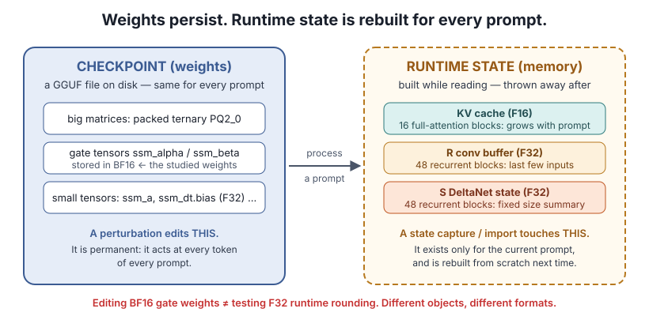
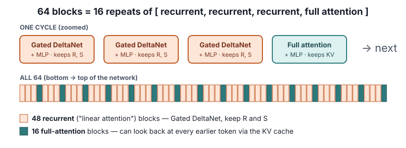
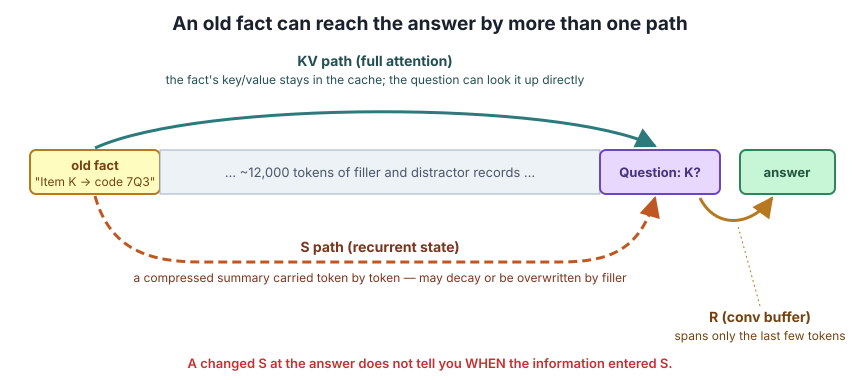

# Lesson 1 — The model: weights, state and three memory paths

> **In one sentence:** a model is a fixed file of numbers (weights) that builds temporary memory (runtime state) while it reads, and an old fact can reach the answer through more than one kind of memory.

[← Course home](README.md) · [Next: Gated DeltaNet →](02-gated-deltanet.md)

---

## 1.1 What a language model does

A **language model** takes a sequence of tokens and assigns a probability to every possible *next* token. That's all. Answering questions, writing code and chatting are all repeated next-token prediction.

A **token** is an integer ID for a piece of text. It is often a word fragment, not a whole word. `" storm"` might be one token; `"QX-4471"` might be several.

## 1.2 Weights vs runtime state (the most important distinction in this course)

| | **Weights** (checkpoint) | **Runtime state** |
|---|---|---|
| What | Saved numerical parameters | Temporary memory built while reading |
| Where | A file on disk (here: GGUF) | GPU memory during one run |
| Lifetime | Persist across all prompts | Rebuilt from scratch for each prompt |
| Changed by | A **perturbation** (editing bytes in a copy of the file) | A **state import** (loading saved memory) |
| Effect of a change | Acts at *every token of every prompt* | Acts only on the prompt it is loaded into |

Why it matters: the studies used both kinds of intervention. "We changed the gate" can mean editing gate **weights** (permanent, everywhere) or swapping gate-produced **state** (one prompt, one moment). The two support very different conclusions.

**Vocabulary for comparisons:**

- **Checkpoint:** one saved set of weights.
- **Original / baseline:** the downloaded Bonsai 2 checkpoint. *Not* the full-precision Qwen model it was derived from.
- **Variant:** a copy of the original with a specific, recorded weight patch.
- **Prompt:** the input text. **Prefix:** the part processed before a chosen boundary. **Continuation:** the text after it, either fixed or generated.

## 1.3 The file: GGUF, quantization and number formats

**GGUF** is a file format holding weights, tensor metadata and the tokenizer.

**Quantization** means storing weights with fewer bits. Bonsai 2 packs its big matrices as `PQ2_0` **ternary** groups, where each weight is essentially one of three levels times a shared group scale. It keeps some small, sensitive tensors at higher precision.

Floating-point formats you'll meet:

| Format | Bits | Where it appears in this research |
|---|---|---|
| **F32** | 32 | Runtime R/S recurrent cache; small tensors `ssm_a`, `ssm_dt.bias` |
| **BF16** | 16 (wide range, less precision) | The studied gate weights `ssm_alpha.weight`, `ssm_beta.weight` |
| **F16** | 16 (more precision, narrower range) | The full-attention KV cache in these runs |

⚠️ **Trap:** "The gates are BF16 and the state is F32" are two separate facts. Editing BF16 gate *weights* is a permanent checkpoint change. It does **not** test whether F32 *runtime* rounding piles up step after step.

### The rotated basis (Hadamard), with a 2-D toy

Bonsai 2's packed matrices are stored in a **rotated coordinate system**. The rotation is related to the **Hadamard transform**, a structured orthogonal transform. So a stored number is not directly comparable with the matching number in the original Qwen weights.

⚪ **Toy:** take a 2-D weight `w = (3, 1)`. Rotate the axes by 45°: the stored coordinates become `((3+1)/√2, (3−1)/√2) = (2.83, 1.41)`. Nothing is lost, and rotating back recovers `(3, 1)`. But comparing the stored `2.83` with the original `3` is meaningless. The real transform is the same idea in many more dimensions.

That's why the experiments mostly compare **the original compact checkpoint against controlled copies of itself**. They do not measure "what quantization did" relative to full-precision Qwen.

## 1.4 The architecture: 64 blocks, two kinds

A **block** transforms each token's vector representation. Bonsai 2 has 64, in a repeating pattern of three recurrent blocks and one full-attention block:

- **48 recurrent blocks** (also called "linear attention"). Each runs **Gated DeltaNet** (next lesson) and keeps a **fixed-size** state, no matter how long the prompt is.
- **16 full-attention blocks.** Each can look back at *every* earlier token's stored keys and values, the **KV cache**, which grows with the prompt.
- Every block also has an **MLP** (multilayer perceptron), another transformation of the token vector. Lesson 6 uses the MLP's `ffn_up.weight` as a **control**.
- A **head** is a group of channels with its own attention or recurrent parameters. Blocks have several heads working in parallel.

The [structural analysis](../README.md) documents where each tensor lives and its format. It is a **storage map**, not evidence that any region *causes* a behaviour.

## 1.5 Three memory paths

| Symbol | What it is | Reach |
|---|---|---|
| **KV** | Full-attention key/value cache | Direct access to *any* earlier token |
| **S** | Gated DeltaNet recurrent state | Compressed summary carried forward; can decay or be overwritten |
| **R** | Short convolution buffer in each recurrent block | Directly spans only the last few inputs. But in higher layers those inputs have already been processed by earlier attention and recurrent blocks, so R can *indirectly* reflect older information |

The key consequence: **if the model answers correctly about a fact from 12,000 tokens ago, you do not know which path carried it.** Attention could have looked it up directly. S could have carried it the whole way. Or attention could have looked it up at the last moment and written it into S. That third story matters in Lesson 7.

---

## Check yourself

1. A colleague says "we perturbed the recurrent state by 20%". What question should you ask first?
2. Why can't you subtract a stored Bonsai 2 matrix value from the corresponding Qwen weight to measure quantization error?
3. The KV cache grows with prompt length but S does not. Why does that make "S remembers things" a harder claim than "KV remembers things"?
4. True or false: because R only spans a few tokens, R cannot contain any information about the start of a 12K prompt.

Answers

1. "Did you edit the gate **weights** in the checkpoint, or swap the runtime **state** R/S?" These are different objects. A 20% weight scale change also isn't a measure of damage; see Lesson 6.
2. The packed matrices are in a rotated (Hadamard-related) basis. You must decode the file and undo the rotation before comparing, or you are comparing coordinates in two different systems.
3. S must squeeze everything into a fixed size while later tokens keep writing into it, so information can decay or be overwritten. KV keeps each token's entry separately.
4. False. R *directly* holds only recent inputs, but in higher layers those inputs have already passed through attention and recurrent blocks that may have pulled in older information.

