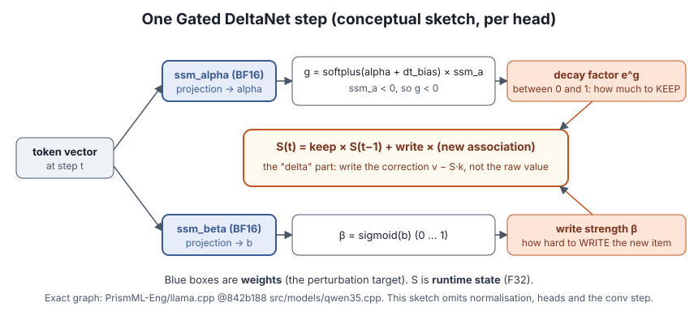
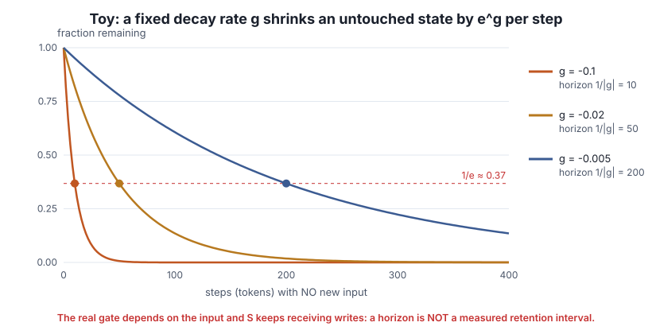

# Lesson 2 — Recurrent memory: Gated DeltaNet and its gates

> **In one sentence:** each recurrent block keeps a fixed-size state S; at every token, a *decay gate* (driven by `ssm_alpha`) decides how much of S to keep and a *write strength* (driven by `ssm_beta`) decides how hard to write the new item.

[← Lesson 1](01-model-and-state.md) · [Course home](README.md) · [Next: loss →](03-next-token-loss.md)

---

## 2.1 The idea of a recurrent state

Think of S as a small whiteboard that the block carries from token to token. At each step it can:

- **forget**: fade what is already written,
- **retain**: leave it alone,
- **update**: write something new.

Unlike the KV cache (a growing notebook with one page per token), the whiteboard never gets bigger. That makes it cheap for long prompts, and it is why Bonsai 2 can hold 256K-token contexts in modest memory. It also means old information can fade or be written over.

## 2.2 One Gated DeltaNet step

For each head, at token *t*:

1. The token vector is projected through **`ssm_alpha`** (a BF16 weight matrix) to get `alpha`.
2. The **decay gate** is `g = softplus(alpha + ssm_dt.bias) × ssm_a`. `softplus(x) = ln(1 + eˣ)` is always positive, and `ssm_a` is stored negative, so `g < 0` and the keep-factor `e^g` lies between 0 and 1.
3. The token vector is also projected through **`ssm_beta`** (BF16) and passed through a sigmoid, giving a **write strength β** between 0 and 1.
4. S is updated: keep a fraction `e^g` of the old state, then write the new key→value association with strength β. The "**delta**" in DeltaNet means it writes the *correction* (what the state currently predicts for this key vs the actual value), not the raw value.

`ssm_a` and `ssm_dt.bias` are small separate **F32** tensors. The studied weights are `ssm_alpha` (and `ssm_beta` during calibration). The exact computation is in the pinned [Prism graph `qwen35.cpp`](https://github.com/PrismML-Eng/llama.cpp/blob/842b188/src/models/qwen35.cpp). The figure is a conceptual sketch that omits normalisation and the convolution step.

**Why study these gates?** They control what S keeps. A slightly wrong decay could, in principle, make the model forget too fast or keep stale information. The investigation asked whether such errors hurt *more* when the needed fact is far away.

## 2.3 Decay horizon: a useful number that is easy to over-read

⚪ **Toy:** suppose `g` were a **fixed** number and **nothing new** were ever written. Each step multiplies the state by `e^g`. After `n` steps what remains is `e^(g·n)`. That falls to `1/e ≈ 37%` when `n = 1/|g|`. This `1/|g|` is the **decay horizon**.

| g | e^g (kept per step) | Horizon 1/\|g\| |
|---|---|---|
| −0.1 | 0.905 | 10 tokens |
| −0.02 | 0.980 | 50 tokens |
| −0.005 | 0.995 | 200 tokens |

**Why a horizon is *not* a measured retention interval:**

- The real `g` changes with every input token, because it depends on `alpha`, which depends on the token.
- S keeps receiving new writes, so information can be refreshed, overwritten, or interfered with.
- Normalisation and later layers transform what is read out.
- Full attention can **bypass** S entirely (Lesson 1, three paths).

**Interference** is when later inputs alter or compete with information that would otherwise stay useful. It is one reason "the gate exists, therefore errors grow with prompt length" does not follow.

## 2.4 What a gate change could and could not show

If you perturb `ssm_alpha` (Lesson 6), the changed weights act **at every token**. Even if long prompts got worse, that alone would not prove S was the culprit: attention and later layers see the altered signals too. Separating those paths is what the state-import methods (Lesson 7) are for.

---

## Check yourself

1. With `g = −0.01` fixed and no writes, roughly what fraction of S remains after 100 steps? After 300?
2. Give two reasons a calculated horizon of 50 tokens does not mean the model forgets facts after 50 tokens.
3. Which tensor, `ssm_alpha` or `ssm_beta`, mostly controls how hard a new item is written?
4. The gate tensors are BF16 but S is F32. Does perturbing the BF16 weights test F32 rounding accumulation?

Answers

1. `e^(−1) ≈ 0.37` after 100 steps; `e^(−3) ≈ 0.05` after 300.
2. Any two of: the real gate is input-dependent, not fixed; new writes refresh or overwrite S; normalisation changes readout; full attention can supply the fact without S.
3. `ssm_beta`, through the sigmoid write strength β.
4. No. A weight perturbation is a permanent change to the checkpoint. It says nothing about F32 runtime rounding errors accumulating step by step.

