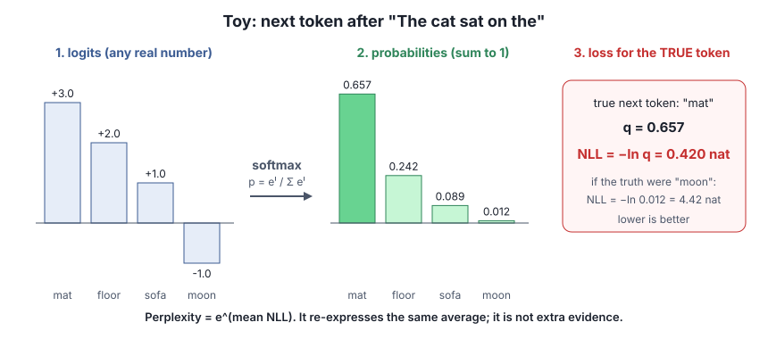
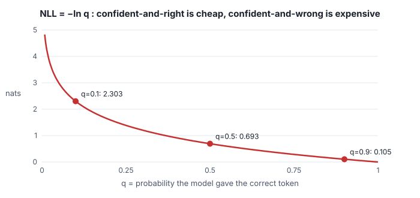
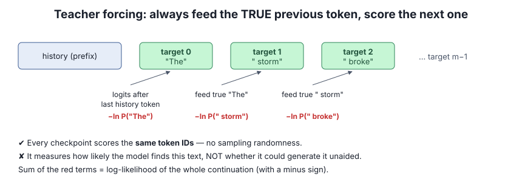

# Lesson 3 — Next-token prediction and loss

> **In one sentence:** the model scores every possible next token (logits), softmax turns those scores into probabilities, and the loss for the true token is −ln of its probability (NLL, in nats).

[← Lesson 2](02-gated-deltanet.md) · [Course home](README.md) · [Next: fair comparisons →](04-fair-comparison.md)

---

## 3.1 From logits to probabilities to loss

- A **logit** is an unnormalised score, one per vocabulary token. It can be any real number.
- **Softmax** turns logits into probabilities that sum to 1: `p_i = e^(l_i) / Σ_j e^(l_j)`.
- If the true next token got probability `q`, its **negative log-likelihood** is `NLL = −ln q`, measured in **nats** (natural-log units). **Lower is better.**

⚪ **Toy worked example** (numbers from the figure): logits `[3, 2, 1, −1]` for *mat, floor, sofa, moon*.

1. Exponentiate: `[20.09, 7.39, 2.72, 0.37]`, which sums to 30.57.
2. Divide: `[0.657, 0.242, 0.089, 0.012]`.
3. The true token is *mat*: `NLL = −ln 0.657 = 0.420 nat`. Had the truth been *moon*: `−ln 0.012 = 4.42 nats`.

Reference points from the brief: `q = 0.5 → 0.693 nat`, `q = 0.1 → 2.303 nats`.

## 3.2 Mean NLL and perplexity

**Mean NLL** averages the per-token NLLs over a *specified* set of target tokens. That set is the **denominator**, and every result in this research names it.

**Perplexity** = `e^(mean NLL)`. ⚪ Two tokens with NLL 0.693 and 2.303 have mean 1.498 and perplexity `e^1.498 ≈ 4.47`. Perplexity is just another way of writing the same average. It is **not** a second piece of evidence.

**Excess NLL** = a variant's mean NLL − the original's mean NLL *on the same targets*. Positive means the variant predicts worse. Units: **nat per target token**.

## 3.3 Teacher forcing

To score a fixed continuation, the scorer feeds the **true** previous token at each step (never the model's own guess) and records `−ln P(true next token)`.

- ✔ Every checkpoint scores **exactly the same token IDs**. There is no sampling randomness.
- ✔ The **log-probability of a whole continuation** is the sum of its per-token log-probabilities.
- ✘ It measures how likely the model finds this text. It does **not** show the model could *generate* that text on its own.

## 3.4 Getting tokens right: tokenizer, chat template, special tokens

- The **tokenizer** converts text to IDs.
- The **chat template** wraps user text in role markers and formatting. Tokenising plain prose is different from tokenising a chat prompt.
- **BOS** is the beginning-of-sequence special token. **End-of-turn** is the special token that closes the scored answer in the retrieval tasks.
- **Alignment rule:** tokenising the full "prompt + answer" string must reproduce the frozen prompt-prefix IDs exactly. If a boundary merges differently, even the first answer token is scored against the wrong position.

## 3.5 Length words that are easy to confuse

| Term | Meaning |
|---|---|
| **Context window** | Token capacity *configured* for a run (for example 16,384) |
| **History length** | Number of prior IDs *actually supplied* before a target span. It need not fill the window |
| **Prefill** | Processing the prompt/history in bulk to build runtime state |
| **Decode** | Evaluating later tokens one step (or batch) at a time |

⚠️ **Trap:** a longer prompt and a fact placed *farther from the question* are **different experimental factors**. Adding neutral text makes a prompt longer, but whether it increases the distance a fact must be remembered depends on *where* the text goes (Lesson 5).

---

## Check yourself

1. Logits for three tokens are `[0, 0, 0]`. What is each probability, and what is the NLL of the true token?
2. Model A gives the true token `q = 0.9`, model B gives `q = 0.8`. What is B's excess NLL over A on this token?
3. A report gives both mean NLL and perplexity for the same targets. Do you have two independent confirmations?
4. Why does teacher forcing make comparisons across checkpoints fair, and what does it give up?

Answers

1. Each is 1/3; NLL = `ln 3 ≈ 1.099 nat`.
2. `−ln 0.8 − (−ln 0.9) = 0.223 − 0.105 = +0.118 nat`.
3. No. Perplexity is `e^(mean NLL)`, the same number in another form.
4. Every checkpoint is scored on identical token IDs with no sampling noise. It gives up any claim about free generation: the model is never asked to produce the text itself.

