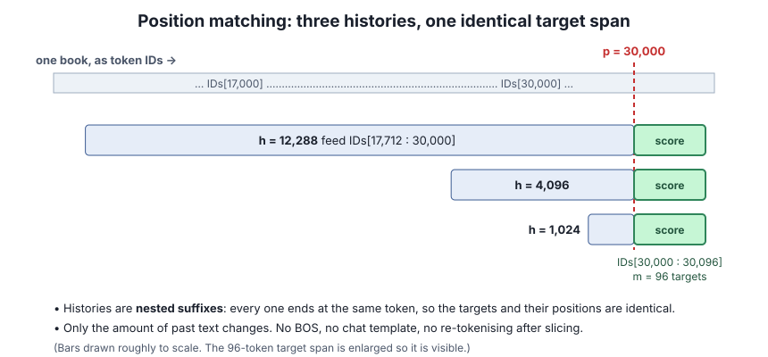

# Lesson 4 — Fair comparisons on natural text

> **In one sentence:** to ask "does more history change the loss?", score the *same target tokens at the same positions* under histories that differ only in how far back they reach.

[← Lesson 3](03-next-token-loss.md) · [Course home](README.md) · [Next: retrieval →](05-retrieval-and-margins.md)

---

## 4.1 Position matching with nested suffixes

The natural-text scorer picks, for each book:

- an absolute position **p** (for example 30,000),
- a history length **h**,
- a number of targets **m** (here 96).

It feeds `IDs[p−h : p]` and scores `IDs[p : p+m]` with teacher forcing. Target 0 is scored from the logits after the last history token. Then the true target 0 is fed to score target 1, and so on.

With `h = 1,024 / 4,096 / 12,288`, the three histories are **nested suffixes**: each is the tail of the next and all end at the same token. So:

- the **target IDs are identical** in all three conditions,
- their **absolute positions are identical**,
- the **only** thing that changes is how much past text the model saw.

This is **position matching**. Without it, a change in loss could simply mean you scored different prose.

Also: plain-document slices used **no BOS, no chat template, and no retokenising after slicing**. Every one of those would shift or change the IDs. The [scorer validation](../scorer/VALIDATION_REPORT.md) documents the alignment checks.

🟢 **Measured:** the scorer validation scored the same 96 target IDs under nested 1K/4K/12K histories on four books, and all identity checks passed. That is a *go* for the tool, not evidence about the hypothesis.

## 4.2 Why the stock perplexity tool wasn't enough

The pinned `llama-perplexity` tool cuts a document into **context-sized chunks**, resets between chunks, and scores only part of each chunk. So if you change only its context-size flag, you change **which token positions** get scored. A difference in perplexity could then come from scoring different tokens, not from the extra context.

The custom scorer was validated against a small fixture of stock logits. It is **sparse** in its *output*: it records one gold-token NLL per target instead of saving full-vocabulary logit arrays, which would be huge. ("Sparse" here has nothing to do with sparse neural networks.)

## 4.3 What excess NLL across histories can and cannot tell you

**Excess NLL** (variant minus original, same targets) is useful for **calibrating a perturbation's dose** (Lesson 6).

But suppose excess NLL rises with history length. That slope is **not** automatically "a stored fact surviving that many tokens". Extra context can help or hurt prediction through attention, through recurrent state, or through both. Natural text has no single "fact" you placed at a known distance. Lesson 5's retrieval tasks were built to fill that gap.

⚪ **Toy:** the original model has mean NLL 2.10 at 1K history and 1.95 at 12K. A variant has 2.13 and 1.99. Excess NLL is +0.03 at 1K and +0.04 at 12K. The variant's extra damage grew by 0.01 nat/token with longer history. That is *interesting*, but it doesn't say which path caused it or whether any particular fact was lost.

---

## Check yourself

1. Why must all three histories end at exactly position p?
2. You re-run `llama-perplexity` with `-c 4096` instead of `-c 1024` and perplexity drops. Name one boring explanation that has nothing to do with memory.
3. Why was BOS deliberately *not* added to the document slices?
4. What does "sparse scorer" mean here?

Answers

1. So the scored targets are the same IDs at the same absolute positions. Only the amount of history varies.
2. The tool chunks and resets differently, so a different set of token positions was scored. Some positions are easier than others.
3. Adding BOS (or a template, or retokenising) would change the ID sequence or its positions and break the match between conditions.
4. It records only the gold-token NLL for each target, not the full logit vector. Sparse *output*, not a sparse model.

