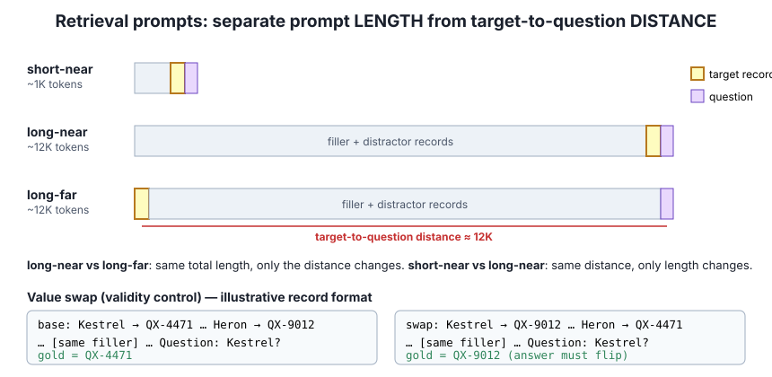
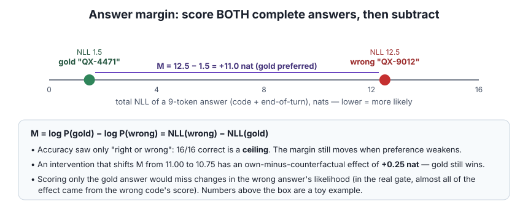

# Lesson 5 — Retrieval tasks and answer margins

> **In one sentence:** place a known fact far back in a prompt and ask for it. First prove the task can't be solved by a shortcut, then measure *how strongly* the model prefers the right answer over a plausible wrong one.

[← Lesson 4](04-fair-comparison.md) · [Course home](README.md) · [Next: perturbations →](06-perturbations-and-controls.md)

---

## 5.1 Vocabulary of a retrieval prompt

| Term | Meaning |
|---|---|
| **Registry** | One independently generated set of item→code records |
| **Target** | The record the question asks about |
| **Distractors** | Other plausible records |
| **Filler** | Intervening text between a remote record and the question |



The three layouts pull apart two factors that are easy to mix up:

- **short-near** (~1K tokens): the target is close to the question.
- **long-near** (~12K): the same short distance, but a long prompt.
- **long-far** (~12K): the same length as long-near, with the target far from the question.

**long-near vs long-far** changes only **target-to-question distance**. **short-near vs long-near** changes only **prompt length**.

## 5.2 Shortcuts: how the first pilot fooled itself

🟢 **Measured:** in the [early pilot](../EXPERIMENT_REPORT.md), every model arm answered the synthetic questions correctly. But only the target code had one particular prefix, and only its name had one particular format. A **question-blind rule** ("pick the code that looks different") could answer every question *without reading the question*. High accuracy therefore proved nothing about retrieval.

⚪ **Toy shortcut to spot:**

```
Robin  → AB-1182
Heron  → AB-5520
kestrel_7 → ZQ-9001      ← only lowercase_underscore name, only ZQ- code
Wren   → AB-3307
Question: what is kestrel_7's code?
```

The fix was to make target and distractor formats **exchangeable**: every record looks like it could be the target. A **shortcut audit** then checked that rules like first/last record, code prefix, name format and numeric order could *not* predict the answer. See the [corrected design](../NEXT_EXPERIMENT_DESIGN.md).

## 5.3 Validity controls

- **Value swap:** exchange two remote codes. Leave the question and the recent suffix (the final 1,024 IDs) identical. If the model's answer **flips with the swap**, it is tracking the assigned value, not a fixed preference for some code. 🟢 In the remote-state gate the code identity reversed within every swap pair.
- **Target removal:** delete the queried record. A large drop in the gold-vs-wrong margin shows the record matters.

⚠️ These controls show the **prompt is valid** (the answer depends on the remote record). They do **not** show *which internal path* carried it.

## 5.4 Accuracy hits a ceiling, so use margins

**Exact accuracy** counts responses that exactly match. 🟢 The original model answered **16/16** base/swap prompts correctly in the remote-state gate. When every arm is perfect, accuracy is at a **ceiling**, and a weakened preference is invisible.



The fix: teacher-force **both** complete candidate answers, the **gold** code and a plausible **wrong** code. Each is 9 tokens (code + end-of-turn) under the same chat template. Then:

$$
M=\log P(\text{gold})-\log P(\text{wrong})=\text{NLL}(\text{wrong})-\text{NLL}(\text{gold})
$$

- ⚪ Gold NLL 2, wrong NLL 3 → `M = +1 nat`, so gold is preferred.
- ⚪ If swapping a state moves `M` from 11.00 to 10.75, the **own-minus-counterfactual effect** is **+0.25 nat**, even though gold still wins in both conditions.
- 🟢 Real baseline margins in the remote-state gate ranged **+7.212 to +13.350 nats** (mean +11.092). Gold was very strongly preferred.
- 🟢 In that gate, almost all of the state effect came from the **wrong** code's score (−0.249 nat average change) while the gold score barely moved (+0.0001). Scoring only the gold answer would have missed it.

Things that must match between candidates: length, end-of-turn policy, token alignment.

## 5.5 Generation and F1 (a different question)

**Free generation** picks tokens using a decoding rule. The early pilots used **temperature 0** (always the top token) and a fixed seed. That makes outputs reproducible, but it doesn't make the task valid.

The LongBench-E subset used **answer F1**. After normalising text:

- **precision** = share of predicted tokens that appear in the reference,
- **recall** = share of reference tokens that were recovered,
- **F1** = their harmonic mean `2PR/(P+R)`.

Its 40 selected examples are **not** a full LongBench score. F1, teacher-forced NLL and margins each answer a different question.

## 5.6 Keep units attached

| Measure | Unit | Thresholds used |
|---|---|---|
| Natural-text excess NLL / interaction | **nat per target token** | +0.005 |
| Complete-answer margin effect | **nat per answer** (9 tokens) | +0.5 (remote-state gate), +0.1 (pre-question timing) |

These thresholds measure different things (different **estimands**, Lesson 9) and can't be converted into each other.

---

## Check yourself

1. Why compare long-near with long-far rather than short-near with long-far?
2. Every arm scores 24/24. Can you conclude the perturbation had no effect on retrieval?
3. Gold NLL = 1.2, wrong NLL = 9.7. What is M? After an import, wrong NLL = 9.4 and gold is unchanged. What is the own-minus-counterfactual effect?
4. A value swap flips the model's answer. What does that establish, and what does it *not* establish?
5. Predicted answer "the red house", reference "red house on hill" (after normalisation). Compute precision, recall and F1.

<details><summary>Answers</summary>

1. long-near and long-far have the same total length, so only distance differs. short-near vs long-far changes length *and* distance at once.
2. No. Accuracy is at ceiling. The margin could still have shrunk.
3. `M = 8.5`. The counterfactual margin is `9.4 − 1.2 = 8.2`, so the effect is `8.5 − 8.2 = +0.3 nat`.
4. It establishes that the answer depends on the assigned remote value (prompt validity). It does not show which path (KV, S or R) carried the value.
5. Predicted tokens {the, red, house}; reference {red, house, on, hill}; overlap 2. P = 2/3, R = 2/4 = 0.5, F1 = 2·(0.667·0.5)/(1.167) ≈ 0.571. (Real normalisation usually drops articles like "the", which would make P = 1 and F1 ≈ 0.667.)

</details>
