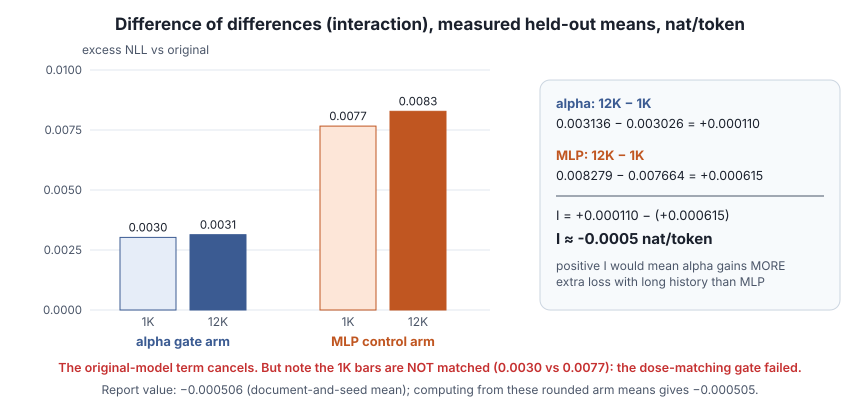

# Lesson 6 — Perturbations, doses and controls

> **In one sentence:** deliberately damage a copy of the weights, measure how much short-context damage that causes (the *dose*), and compare it against an equally damaging control, so that any *extra* long-context damage means something.

[← Lesson 5](05-retrieval-and-margins.md) · [Course home](README.md) · [Next: state import →](07-state-import.md)

---

## 6.1 Making a perturbation safely

A **perturbation** is a deliberate numerical change used to test sensitivity. The procedure:

1. Copy the original GGUF with a copy-on-write **reflink**. This is instant, and the source stays read-only.
2. Change only the selected tensor bytes.
3. Verify that **every other byte is unchanged**.
4. Write a **patch manifest** recording exactly which weights (or quantized-group scales) changed and by how much.

A **seed** makes the random +/− sign pattern reproducible. Using several seeds tests whether a conclusion depends on one lucky or unlucky pattern.

⚠️ **Trap:** "a 20% perturbation" describes a **scale multiplier**, not the damage it causes to predictions. BF16/F16 rounding can also shrink or erase small requested changes, so the *actual* stored values were checked after writing.

## 6.2 The two arms

| Arm | What changed | Role |
|---|---|---|
| **Alpha** | `ssm_alpha` in all 48 recurrent blocks | The treatment: the recurrent decay gate |
| **MLP control** | A sampled subset of `ffn_up` groups | Non-gate damage of similar size |

For the MLP arm, **coverage** is the fraction of eligible groups selected and **strength** is the scale change applied to them. (A beta-only candidate was examined during calibration but was not the held-out treatment arm.)

**Why a control?** If both arms do equal short-context damage, a *difference* in long-context damage is informative. Comparing alpha against the untouched model alone can't tell "gate-specific" damage from "any damage makes long prompts worse". "Control" does **not** mean the MLP can't affect recurrent state. It changes the inputs that later blocks, including recurrent ones, receive.

## 6.3 Dose and dose matching

The count of changed weights and the nominal multiplier are **not** the dose. In this research:

> **Dose** = the observed short-history excess NLL (nat/token).

**Dose matching** asks whether the two arms cause similarly sized short-history damage *before* comparing their extra long-history effects. Matching the **mean** does not guarantee matching the **distribution** of damage across texts or tokens.

🟢 **Measured:** in [dose calibration](../dose_calibration/DOSE_CALIBRATION_REPORT.md) the arms matched on calibration books (about +0.0051 vs +0.0054). On the [held-out books](../heldout_nll/HELDOUT_REPORT.md) the match **failed**: alpha +0.0030 vs MLP +0.0077 at 1K, a gap of 0.0046, beyond the frozen 0.003 tolerance.

## 6.4 Data hygiene: calibration, held-out, fresh

| Set | Used for | Rule |
|---|---|---|
| **Calibration** | Choosing doses | Can be looked at freely |
| **Held-out** | Evaluating *frozen* choices | Never used to adjust anything, or it stops being held out |
| **Fresh** | Anything never used for any previous dose or hypothesis choice | The only honest material for a new confirmation |

Other controls:

- **Baseline rerun:** score the original again to measure numerical reproducibility. 🟢 The held-out rerun matched saved baseline NLLs with maximum difference **0**.
- **Control arm:** a comparison for nonspecific damage.
- **Positive control:** deliberately cause a change the assay *should* detect. If it isn't detected, the assay is blind.

## 6.5 Difference of differences (interaction)

$$
I=[L_{\alpha,12K}-L_{\alpha,1K}]-[L_{\mathrm{MLP},12K}-L_{\mathrm{MLP},1K}]
$$

Every `L` averages NLL over the **same target IDs**. `I > 0` means alpha picks up *more extra loss from long history* than the MLP control does, in this scoring setup.

Why the original model drops out: write each `L` as original + excess. The original's 12K and 1K terms appear once with + and once with −, so they cancel.

🟢 **Worked with measured held-out means** (nat/token): alpha went from 0.003026 to 0.003136, a change of +0.000110. MLP went from 0.007664 to 0.008279, a change of +0.000615. `I = 0.000110 − 0.000615 ≈ −0.0005`. The report's document-and-seed mean is **−0.000506**, with a 4-book interval of [−0.0071, +0.0058]. That crosses the +0.005 threshold, so the result is *no support, but not excluded* (Lesson 9).

⚠️ **Even a clearly positive `I` could not isolate recurrent-state damage.** The modified weights act at every token, and full attention and later readout layers can carry the effect. That limitation is what motivates Lesson 7.

---

## Check yourself

1. Why isn't "we scaled 20% of weights by 1.2" a dose?
2. A calibration mismatch is noticed on the held-out set, so the doses are re-tuned on those books. Can they still be called held out?
3. Compute I: alpha 1K = 0.010, alpha 12K = 0.016, MLP 1K = 0.010, MLP 12K = 0.011. Interpret it.
4. The MLP arm damages short context much more than alpha. Why does that weaken the interaction comparison?
5. What does a positive control protect you from?

Answers

1. Dose here means *observed* short-history excess NLL. Nominal scaling can round away or affect prediction very differently depending on where it lands.
2. No. They were used to adjust a choice, so they are now calibration data. You need fresh books.
3. `I = (0.006) − (0.001) = +0.005` nat/token. Alpha gains 0.005 more extra loss from long history than MLP does. The doses were matched at 1K, which makes this more interpretable, but it still doesn't prove S is responsible.
4. With unequal starting damage, differences at 12K could reflect how damage scales with its size rather than anything gate-specific.
5. From reading "no effect" into an assay that could not have detected an effect.

