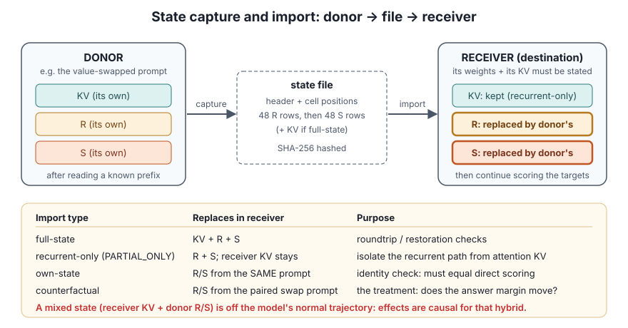
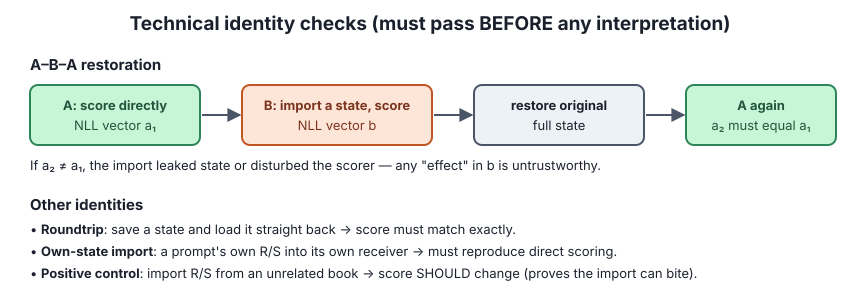
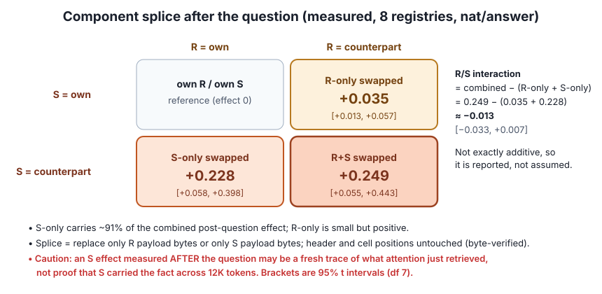
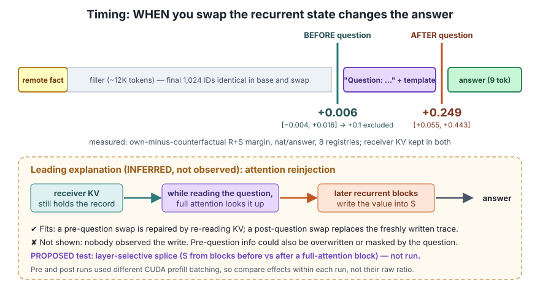
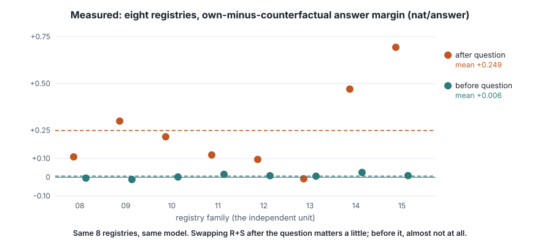

# Lesson 7 — State capture, import and timing

> **In one sentence:** save the model's runtime memory at a known point, load it into a different context, and see whether the answer changes. Always prove first that the plumbing itself changes nothing.

[← Lesson 6](06-perturbations-and-controls.md) · [Course home](README.md) · [Next: reproducibility →](08-reproducibility.md)

---

Weight perturbations act everywhere at once (Lesson 6). State imports are more surgical: they change *what memory the model has* at one moment, with the weights untouched.

## 7.1 Capture and import

- **State capture:** save runtime memory after processing a known prefix.
  - **Full-state:** KV + R + S.
  - **Recurrent-only** (`PARTIAL_ONLY`): R + S only. On import, the receiver's own KV stays in place.
- **Donor:** the prompt or checkpoint that *produced* the saved state.
- **Receiver / destination:** the context that *continues scoring* after import.

"Swap the state" alone is ambiguous. A complete description names the **donor**, the **receiver's weights**, the **receiver's KV**, and **which components** were replaced.

| Import | Donor | Expected result |
|---|---|---|
| **Own-state** | Same prompt as the receiver | Must reproduce direct scoring exactly |
| **Counterfactual** | The paired value-swapped prompt | The treatment: does the margin move? |

## 7.2 Technical identity checks first

- **A–B–A restoration:** score directly (A), import a state and score (B), restore the original full state, then score A again. The last A must equal the first. Otherwise state leaked or the scorer was disturbed.
- **Roundtrip:** save and reload the same state. The score must match.
- **Unrelated-book positive control:** import R/S from a different book. The score *should* change, which shows the import has an effect at all. 🟢 In the [fresh-state assay](../fresh_state/FRESH_STATE_REPORT.md), all 24 of these controls exceeded the 0.01 nat/token sensitivity floor (minimum 0.49).

🟢 In the recent gates these checks passed with **exactly zero** difference. They are **technical validity tests, not evidence for the hypothesis.**

## 7.3 Positions, target 0 and hybrid states

- State files store **cell position metadata**. Importing a 1K-built state into a 12K context can trigger a *non-consecutive position* warning. 🟢 The [memory gate](../memory_gate/MEMORY_GATE_REPORT.md) showed that raw imports and imports with a rebased 4-byte position field gave **identical** NLL vectors in the pinned runtime. That settles this metadata field for that assay only.
- **Target 0 exclusion:** the first answer token may be scored from logits computed *before* the import, so it can't have been affected. Analyses drop it when that is the case.
- **Off-trajectory / hybrid state:** for example, long-history KV sitting beside short-history R/S, or original weights reading a state built by a perturbed checkpoint. The model would never produce that mix in normal use. Effects are **causal for the hybrid**, but may not equal what the intact model does.
- **Reciprocal imports** (swap donor and receiver both ways) reveal receiver dependence. They are **not** an additive split into "state damage" plus "readout damage". **Readout** means the receiver computations that turn imported state plus current input into logits.

## 7.4 The remote-value state gate

🟢 **Measured** ([report](../remote_state_gate/REMOTE_STATE_REPORT.md)):

- Setup: 8 fresh registries (08–15). Each has a base and a value-swapped long-far prompt sharing the question and the final 1,024 IDs.
- The receiver keeps its own weights and KV. Only R/S from the swapped counterpart is imported, **after** the question.
- Effect = own-state margin − counterfactual-state margin: **+0.249 nat/answer**, 95% t interval **[+0.055, +0.443]**, positive in 7 of 8 registries.
- The frozen support rule required at least +0.5, so the result is **exclusion of +0.5**, *with evidence for a smaller positive effect*. No answer flipped, and the baseline margin averaged +11.09.

## 7.5 Splitting R from S: component splice

A **component splice** replaces only the R payload bytes or only the S payload bytes in a saved state file. The header and the other component stay untouched (byte-verified). The four post-question conditions form a 2×2 grid.

🟢 **Measured** ([report](../remote_components/COMPONENT_REPORT.md)): S-only +0.228, R-only +0.035, R+S +0.249.

The **R/S interaction** = combined − (R-only + S-only) ≈ −0.013, interval [−0.033, +0.007]. Reporting it avoids assuming the two effects simply add up.

## 7.6 Timing: before vs after the question

The same experiment also imported combined R/S **before** the question (28–29 tokens before the answer boundary). It then teacher-forced the question plus the answer.

🟢 **Measured:** before-question effect **+0.006** nat/answer, interval [−0.004, +0.016]. That is below the frozen +0.1 threshold, so the result is **exclusion of +0.1** *in this fixed assay*.

### Why the timing matters

A **post-question** S effect might be a *fresh* record of what attention just retrieved while reading the question. It does not have to be 12K-token retention by S. A **pre-question** import is a better test of what S held *before* the question. Even then, the receiver's KV can overwrite or mask it while the question is processed.

🟡 **Inferred: attention reinjection.** While the model reads the question, a full-attention block looks up the old record in KV, and later recurrent blocks write a value-dependent trace into S. This fits the data: a pre-question swap gets "repaired" by re-reading KV, while a post-question swap replaces the fresh trace. **Nobody has observed that write directly.**

🟣 **Proposed: layer-selective splice.** Compare S taken from early recurrent blocks with S from blocks *after* a full-attention block. This has not been run. Even a positive late-block effect would not pinpoint the exact write step.

⚠️ The pre- and post-question runs used different CUDA prefill batching (Lesson 8). So effects are compared **within** each run. The "2.5%" ratio between them is descriptive only.

---

## Check yourself

1. A recurrent-only import is described as "swapping the state". List what stays the same in the receiver.
2. The A–B–A check fails: the second A differs from the first by 0.03 nat. What do you do with the B result?
3. Why is target 0 sometimes excluded from state-import effects?
4. The post-question S-only effect is +0.228. Does that show S carried the remote fact across 12K tokens of filler? Why or why not?
5. Why is the pre-question result a better test of long-range retention, and what could still hide a real effect there?
6. Combined R+S = 0.249, R-only = 0.035, S-only = 0.228. Compute the interaction and explain why it's reported.

Answers

1. The receiver's weights, its attention KV, its token IDs to be scored, and its scoring profile. Only R and S are replaced.
2. Don't interpret it. The pipeline leaks state or disturbs the scorer, so fix the implementation first.
3. Its logits may have been computed before the import happened, so the import can't have affected it. Including it would dilute the effect with a guaranteed zero.
4. No. The swap happened *after* the question. Attention may have retrieved the fact from KV during the question and written it into S. The effect shows post-question S matters, not *when* the information got there.
5. It replaces R/S as they were before the question, so any effect must come from what the state already held. But the receiver's KV can re-retrieve the fact during the question and overwrite or mask the imported difference.
6. `0.249 − (0.035 + 0.228) = −0.014` (the report gives −0.013 from unrounded values). The components are not exactly additive, so reporting the interaction avoids hiding that.

