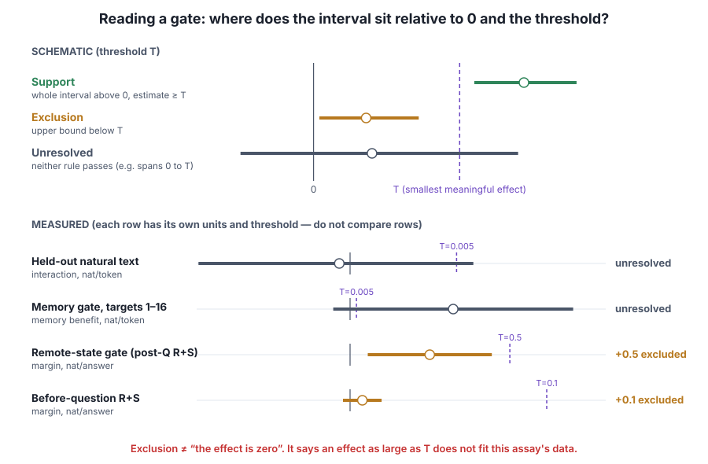
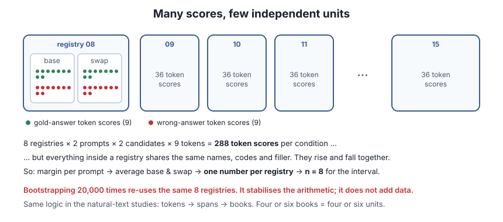

# Lesson 9 — Statistics and claims

> **In one sentence:** decide in advance exactly what you are estimating and what result would count, compute uncertainty over the truly independent units, and never let a statistical verdict grow into a mechanistic claim.

[← Lesson 8](08-reproducibility.md) · [Course home](README.md) · [Next: the story so far →](10-story-so-far.md)

---

## 9.1 Assay, estimand, threshold, gate

- **Assay:** one fully specified measurement procedure (prompts, scoring, intervention, analysis).
- **Estimand:** the *exact* quantity being estimated. "Does the model remember?" is too vague. "Mean own-minus-counterfactual 9-token answer margin across eight registry families" is an estimand.
- **Smallest meaningful effect (T):** a threshold chosen **before** results.
- **Gate:** a predeclared decision rule.
  - **Support gate:** what estimate, interval and consistency are required to support the prediction. For example: mean ≥ +0.5, lower bound > 0, and at least 6 of 8 registries positive.
  - **Exclusion gate:** the interval's upper bound falls below T, so an effect as large as T doesn't fit the data *in this assay*.
  - **Unresolved:** neither rule passed.
- **Go/no-go:** does the evidence justify the next, more expensive experiment?



⚠️ **Exclusion is not "the effect is zero".** It means an effect of size T is too large to fit. It says nothing about smaller effects, other assays, or other checkpoints.

## 9.2 Independent units and clustering



Token scores within one span, spans within one book, and base/swap prompts within one registry are **correlated**. They share the same underlying text. The **independent unit** is usually the book or the registry family.

So "288 token scores" in the remote gate becomes **n = 8** for the interval. Similarly, the held-out study had 4 books and the fresh-state study had 6.

- **Cluster bootstrap:** resample whole books or registries (and sometimes seeds) with replacement, recompute the estimate, and repeat 20,000 times. That many repeats **stabilises the arithmetic**. It does **not** create 20,000 books.
- **t interval** over 6 or 8 cluster means: `mean ± t(0.975, n−1) × sd/√n`.
- With only 4–8 clusters, intervals and **leave-one-out** checks can swing a lot.
- An interval across books for **one fixed perturbation seed** says nothing about variation across seeds.

## 9.3 Worked example: recompute the headline interval yourself

🟢 Measured per-registry effects (post-question R+S, nat/answer) from the [remote-state report](../remote_state_gate/REMOTE_STATE_REPORT.md):

```
08 +0.108780   09 +0.299903   10 +0.216186   11 +0.119139
12 +0.095315   13 −0.008040   14 +0.470604   15 +0.693921
```

1. Mean = 1.995808 / 8 = **+0.249476**
2. Sample SD = **0.232054**
3. SE = 0.232054 / √8 = **0.082043**
4. t(0.975, df 7) = **2.3646**
5. Interval = 0.249476 ± 2.3646 × 0.082043 = **[+0.0555, +0.4435]** ✔ matches the report.

Gate check: lower bound > 0 ✔; 7/8 positive ✔; but the mean is < 0.5 and the upper bound 0.4435 < 0.5, so the result is **exclusion of +0.5**.

**Sensitivity (leave-one-out):** drop registry 15 (the largest) and the 7-registry mean becomes +0.186 with interval [+0.039, +0.333]. Drop registry 14 and it becomes +0.218 [+0.004, +0.432]. The positive sign holds, but the size moves noticeably. That is what "small-cluster instability" looks like.

Try it in the [playground](playground.html#stats): untick registries for leave-one-out, and run the bootstrap.

## 9.4 What a confidence interval does and doesn't mean

Under its assumptions, a nominal 95% *procedure* covers the fixed true effect in about 95% of repeated studies. It does **not** mean "there's a 95% probability the true effect is inside *this* interval". The effect is fixed; the interval is what varies. With few clusters, the *actual* coverage can differ from 95%.

## 9.5 Power, equivalence, sensitivity, multiple looks

- **Power:** the chance a gate would detect a specified true effect. A threshold near the noise level can give an inconclusive result even after thousands of scored tokens.
- **Equivalence:** does the *whole* interval sit inside a prespecified tolerance band? A failed equivalence test does not prove a difference: the interval may simply be wide.
- **Sensitivity analysis:** leave one book out, look at early vs late targets, try an alternative justified interval method. These **qualify** the frozen primary decision. They don't silently replace it.
- **Multiple looks** at the same data can suggest follow-ups, but they are not fresh confirmation.
- **Post hoc** means chosen after seeing results. It can reveal mechanisms but does not inherit the frozen test's error guarantees.
- **Replication** means the same question and analysis on genuinely **new** documents, registries or seeds. Rerunning the same computation on the same files checks arithmetic, which is valuable, but it is not replication.

## 9.6 Prediction, observation, mechanism

| Level | Example | What it takes |
|---|---|---|
| **Prediction** | "Alpha damage should grow with history" | A hypothesis |
| **Observation** | "The margin dropped 0.249 after a counterfactual R/S import" | A valid measurement |
| **Mechanism** | "S carried the fact across the filler" | Controls that remove or hold fixed every alternative path |

- A checkpoint can lose more on long text without recurrent memory being the cause.
- A state import can change answer likelihood without proving S held the fact through the filler.
- A baseline can answer every question while its margins still change.

---

## Check yourself

1. Why is n = 8, not 288, for the remote-state interval?
2. An interval is [−0.004, +0.016] and T = +0.1. Verdict? Does this mean the effect is zero?
3. The memory gate primary gave [−0.013, +0.175] with T = +0.005. Verdict?
4. "We bootstrapped 20,000 times, so the result is very precise." What's wrong?
5. After seeing the data you notice late target tokens show a bigger effect and report that as the main finding. What's the problem?
6. Classify: (a) "Post-question S-only import changed the margin by +0.228." (b) "Attention wrote the value into S during the question." (c) "A layer-selective splice would localise the write."

<details><summary>Answers</summary>

1. Everything within a registry shares names, codes and filler, so those scores are correlated. The registry is the independent unit.
2. Exclusion of +0.1: the upper bound is below T. No. It only rules out an effect as large as 0.1 in this assay; smaller effects are compatible.
3. Unresolved. The interval crosses 0 (no support) and reaches above T (no exclusion).
4. Bootstrap repeats resample the same few clusters. They make the interval's arithmetic stable, not the data more plentiful.
5. It's post hoc. It can motivate a new frozen test but can't replace the preregistered primary result or claim its error guarantees.
6. (a) 🟢 measured; (b) 🟡 inferred; (c) 🟣 proposed.

</details>
