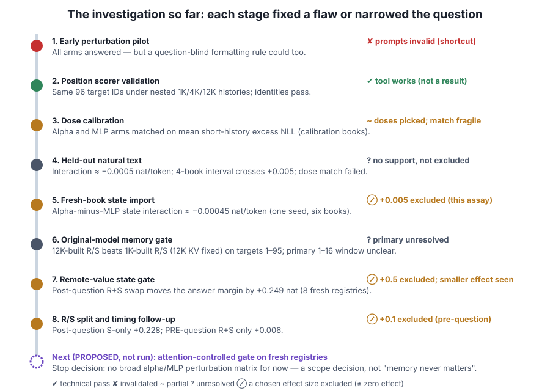

# Learning the Bonsai 2 recurrent-state research

A self-paced course built from [LEARNING_REFERENCE.md](../LEARNING_REFERENCE.md). It assumes you know arrays, functions and basic probability, and little machine learning. After it you should be able to read every report in `analysis/bonsai2/`, check its numbers yourself, and say exactly what each result does and does not show.

## The research question in one paragraph

Bonsai 2 is a compressed 27-billion-parameter language model. Most of its blocks are **recurrent**: they carry a fixed-size memory forward token by token. That memory is controlled by small **gate weights** (`ssm_alpha`, `ssm_beta`). The question was: *if those gate weights are slightly wrong, does the damage get worse when the useful fact is far back in the prompt?* The studies built and validated several ways to measure this. They did **not** find that gate damage grows with distance. The latest result suggests that when the model answers a question about a remote fact, it mostly **looks the fact up with attention while reading the question** and then writes it into recurrent memory. It does not seem to rely on carrying the fact across the whole prompt. That last part is an inference, not a measurement.

## How to read these lessons

Every claim is tagged so you always know how much weight it can bear:

| Tag | Meaning |
|---|---|
| 🟢 **Measured** | A score or identity check from a completed, linked run |
| 🟡 **Inferred** | An explanation that fits the measurements but was not directly observed |
| 🟣 **Proposed** | A future experiment that has **not** run |
| ⚪ **Toy** | A made-up number to illustrate a concept |

Three distinctions come up in almost every lesson. If you remember only these, you will avoid most misreadings:

1. **Weights vs runtime state.** The file on disk vs the temporary memory built while reading a prompt.
2. **Predictive loss vs retrieval success.** "How surprised was the model by this text?" vs "Did it pull out the right fact?"
3. **Measured effect vs internal cause.** "Changing X moved the score" vs "X is *why* the model behaves this way."

## The path

| # | Lesson | You will be able to… | Time |
|---|---|---|---|
| 1 | [The model: weights, state and three memory paths](01-model-and-state.md) | tell a checkpoint from runtime state; name KV, R and S | 25 min |
| 2 | [Recurrent memory: Gated DeltaNet and its gates](02-gated-deltanet.md) | explain what alpha and beta do; compute a decay horizon and say why it is not a retention measurement | 25 min |
| 3 | [Next-token prediction and loss](03-next-token-loss.md) | go from logits to NLL and perplexity by hand; explain teacher forcing | 30 min |
| 4 | [Fair comparisons on natural text](04-fair-comparison.md) | design a position-matched comparison; spot why stock perplexity misleads | 25 min |
| 5 | [Retrieval tasks and answer margins](05-retrieval-and-margins.md) | find a shortcut in a prompt set; compute an answer margin | 30 min |
| 6 | [Perturbations, doses and controls](06-perturbations-and-controls.md) | explain dose matching; compute a difference of differences | 30 min |
| 7 | [State capture, import and timing](07-state-import.md) | trace exactly what a recurrent-only import changes; read the R/S splice and timing results | 40 min |
| 8 | [Reproducibility and execution](08-reproducibility.md) | explain freezes, hashes and why batch size changes scores | 15 min |
| 9 | [Statistics and claims](09-statistics-and-claims.md) | compute a cluster-level t interval; read support/exclusion/unresolved gates | 40 min |
| 10 | [The story so far and what comes next](10-story-so-far.md) | summarise every stage with its claim boundary; critique the proposed next gate | 25 min |

Also:

- **[GLOSSARY.md](GLOSSARY.md)**: every term, one line each, with the lesson that explains it.
- **[playground.html](playground.html)**: interactive widgets. Drag logits and watch NLL change, slide histories, compute margins and intervals from the real registry data, and try the gate rules.
- **[make_plots.py](make_plots.py)**: regenerates the data-driven figures (`python3 analysis/bonsai2/learn/make_plots.py`).

Each lesson ends with **Check yourself** questions. The answers are folded underneath; try each one before you open it.

## Suggested study rhythm

- **Day 1:** Lessons 1–3. This covers the vocabulary of models and loss.
- **Day 2:** Lessons 4–6. This covers how to build a fair measurement.
- **Day 3:** Lessons 7–8. This covers the state-import toolkit, the heart of the recent work.
- **Day 4:** Lessons 9–10, then read [remote_components/COMPONENT_REPORT.md](../remote_components/COMPONENT_REPORT.md) end to end and see how much you can follow.

## Would interactive sessions help?

Yes, for three parts in particular. Written lessons handle vocabulary well, but these skills are learned by doing:

1. **Socratic review after each day.** Ask Claude to "quiz me on lessons 1–3 of the Bonsai learning set, one question at a time, and push back on vague answers". Explaining *why* a recurrent-only import leaves KV in place does more for retention than rereading.
2. **Report walk-throughs.** Pick one report (for example [REMOTE_STATE_REPORT.md](../remote_state_gate/REMOTE_STATE_REPORT.md)) and read it together with Claude paragraph by paragraph. Say out loud whether each sentence is measured, inferred or proposed, and have Claude correct you.
3. **Hands-on recomputation.** Recompute a report's headline number from the raw JSONL/JSON files with Claude pairing. For example, rebuild the +0.249 mean and its interval from `remote_state_gate/comparisons/`. Doing this once makes the "eight registries, not 288 tokens" idea stick.

A good session prompt is: *"I've finished lesson N. Give me three scenario questions where I have to decide whether a claim is measured, inferred or proposed."*
